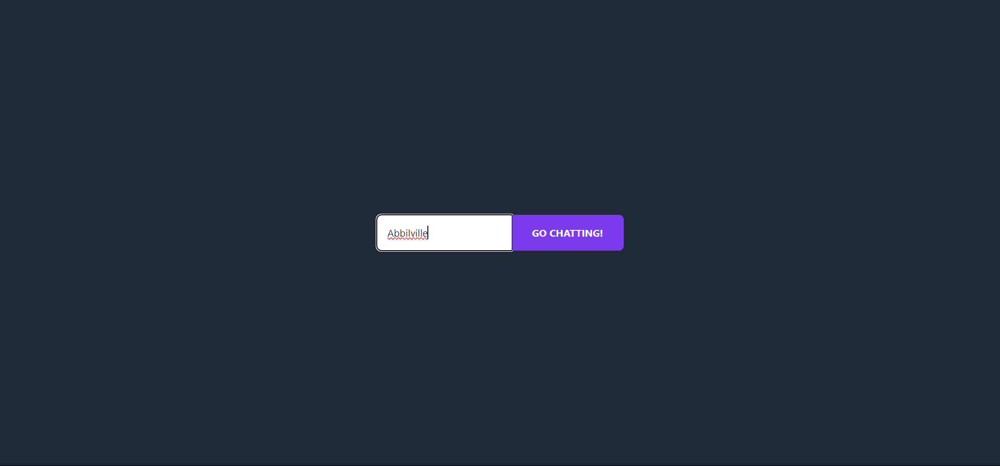
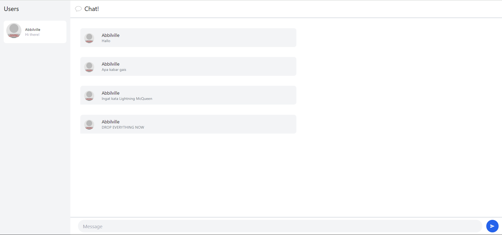

# Tutorial-10
---
#### Nama: Abbilhaidar Farras Zulfikar
#### NPM: 2206026012
#### Kelas: Adpro A
---
### Refleksi
#### 3.1. Original code
  
  
  

#### 3.2. Add some creativities to the webclient
  
  

Pada login page saya mengubah backgroundnya menjadi lebih berwarna seperti laut seperti pengguna sedang menyelam kedalamnya dengan cara menambahkan gradient from blue to black pada kode di html <code>src/components/login.rs</code>. Lalu pada halaman chat, saya mengubah latarnya menjadi seperti dark mode yang mana warnanya dominan gelap sehingga mata tidak terlalu lelah ketika sedang chattingan, pada bagian ini saya mengubah kode html yang berada di <code>src/components/chat.rs</code>